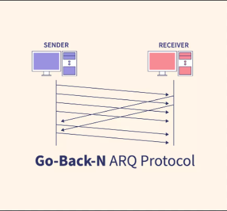

# Go-Back-N protocol

  

>Software that implements the Go-Back-N protocol, containing parallelism, accumulation of ACKs and resending packets in case of loss. It uses sequence numbers and timeouts for recording
>and resending packets.

## 🛠️ Dependencies

- Java (POO)

## 🚀 Getting Started

To test the application, follow these steps:

1. **Download the zip file**;

2. **Extract the file**;

3. **Open it in your environment**;

4. **Run Main**.

## 🖥️ How It Works

1. Class EnviaDados

Responsible for sending data via UDP packets. It includes functionalities to:

- Split a file into smaller packets (divideArquivo);
- Send packets to a specific address and port (enviaPct);
- Manage the sending window and retransmissions in case of packet loss (enviaProximaJanela);
- Monitor sent packets and confirm receipt (run).

2. Class Main

The main class that initiates the data sending and receiving process. It uses:

- RecebeDados to start the data reception thread;
- EnviaDados to start two threads, one for sending packets and another for acknowledgment (ack).

3. Class Pacote

Represents a data packet to be sent. It contains:

- Sequence number and packet data;
- State of receipt confirmation;
- Functions to start and cancel a timer (startTimer, cancelaTimer);
- A static list to keep all created packets.

4. Class RecebeDados
Responsible for receiving data packets via UDP. It includes functionalities to:

- Receive packets and verify the correct sequence (run);
- Write the received data to a file;
- Send acknowledgment (ack) to the sender.

Together, these classes implement a reliable packet sending and receiving protocol over UDP, ensuring that all packets are delivered and confirmed, and handling possible packet losses.
